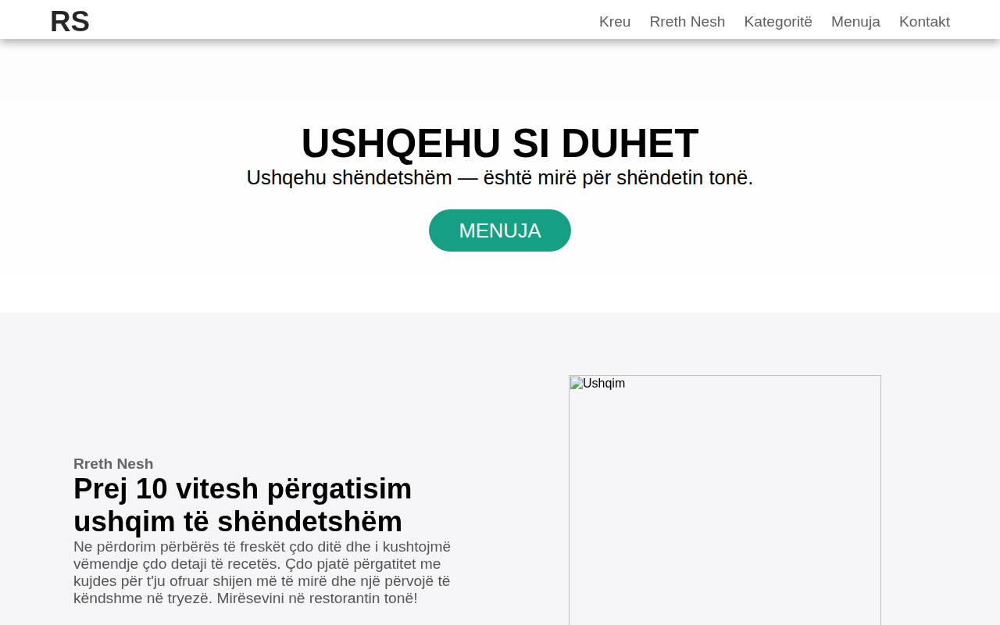

# Restorant

Faqe restoranti me menu dhe kontakt — dizajn modern, përshtatur plotësisht në shqip.

**Demo live:** https://erionnezha.github.io/Restaurant-Website/



## Rreth projektit

Kjo është një faqe web moderne për një restorant, me seksione për prezantimin, kategoritë e ushqimeve, menunë me çmime dhe një seksion kontakti. E gjithë përmbajtja e tekstit është në gjuhën shqipe.

## Si ta hapni lokalisht

1. Shkarkoni ose klononi këtë repo.
2. Hapni file-in `index.html` direkt në shfletuesin tuaj.

```bash
git clone https://github.com/ErionNezha/Restaurant-Website.git
cd Restaurant-Website
```

Pastaj hapni `index.html` në shfletues.

## Teknologjitë

- HTML
- CSS
- JavaScript
- jQuery

## Kontakti

- Telefoni: +355 6XX XXX XXX
- E-mail: shembull@example.com
- Adresa: Tiranë, Shqipëri

## Licenca

Të gjitha të drejtat e rezervuara © 2026 Erion Nezha. Autori: Erion Nezha.

---

# Restaurant

Restaurant website with menu and contact — modern design, fully localized in Albanian.

**Live demo:** https://erionnezha.github.io/Restaurant-Website/


## About

A modern website for a restaurant, with sections for the presentation, food categories, a menu with prices and a contact section. All text content is in Albanian.

## Run locally

1. Download or clone this repo.
2. Open `index.html` directly in your browser.

```bash
git clone https://github.com/ErionNezha/Restaurant-Website.git
cd Restaurant-Website
```

Then open `index.html` in your browser.

## Technologies

- HTML
- CSS
- JavaScript
- jQuery

## License

All rights reserved © 2026 Erion Nezha. Author: Erion Nezha.
